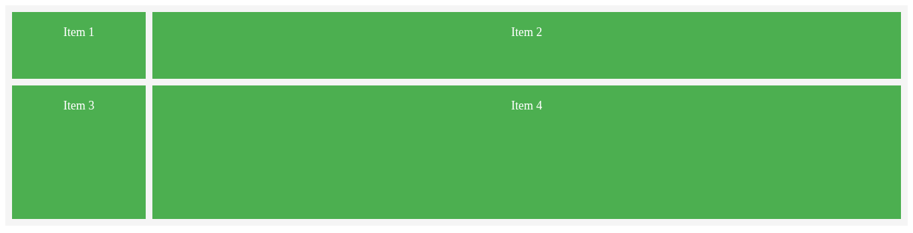

# 🧩 Capítulo 01 – Introdução ao CSS Grid

> 📘 **Objetivo do capítulo**: Compreender o que é CSS Grid, suas vantagens, principais usos e diferenças em relação ao Flexbox.  
> 🎯 **Público-alvo**: Estudantes do 3º ano do Ensino Médio Técnico em Informática.

---

## 📖 1. O que é CSS Grid?

O **CSS Grid Layout**, ou simplesmente **CSS Grid**, é uma tecnologia moderna introduzida no CSS3 que permite criar **layouts bidimensionais** com facilidade e precisão. Isso significa que podemos organizar elementos tanto **em linhas (eixo horizontal)** quanto **em colunas (eixo vertical)** ao mesmo tempo.

Antes do Grid, os desenvolvedores utilizavam combinações complexas de `float`, `position` ou até mesmo tabelas (❌) para criar estruturas visuais. Com o Grid, esse processo ficou muito mais claro, limpo e eficiente.

💡 O Grid funciona como uma **malha de linhas e colunas**, onde você define o esqueleto do layout e distribui os elementos de forma precisa.

---

## 🔁 2. Diferença entre Grid e Flexbox

Embora ambos sejam sistemas de layout **baseados em containers e itens**, eles têm finalidades distintas:

| Característica        | Flexbox                              | Grid                               |
| --------------------- | ------------------------------------ | ---------------------------------- |
| Direção               | Unidimensional (linha **ou** coluna) | Bidimensional (**linha e coluna**) |
| Controle de layout    | Menor controle do espaço total       | Controle total do layout           |
| Distribuição de itens | Boa para elementos fluídos           | Ideal para grade com áreas fixas   |
| Complexidade          | Mais simples para listas             | Mais robusto para páginas inteiras |

> 🧠 **Dica pedagógica**: Use **Flexbox** para **componentes individuais** (como botões ou cards em linha) e **Grid** para **estruturas de página** completas (como o layout principal com cabeçalho, barra lateral e conteúdo).

---

## ✅ 3. Vantagens do CSS Grid

O CSS Grid oferece **vários benefícios práticos**, especialmente para quem está aprendendo e quer criar layouts modernos:

- 🔄 **Organização clara e semântica** do layout da página.
- 🧱 **Controle total** sobre linhas, colunas, tamanhos e espaçamentos.
- 🖼️ Criação de **áreas nomeadas**, facilitando a leitura do código.
- 🧩 Combina facilmente com Flexbox para componentes internos.
- 📱 **Responsividade simplificada** com `minmax()`, `auto-fit` e `media queries`.

---

## 🌐 4. Suporte dos Navegadores

Atualmente, todos os navegadores modernos dão suporte ao CSS Grid:

| Navegador       | Suporte |
| --------------- | ------- |
| Google Chrome   | ✅ Sim  |
| Mozilla Firefox | ✅ Sim  |
| Microsoft Edge  | ✅ Sim  |
| Safari          | ✅ Sim  |
| Opera           | ✅ Sim  |

> ⚠️ Navegadores antigos como o **Internet Explorer 11** possuem suporte parcial e devem ser evitados em novos projetos.

---

## 🧪 5. Exemplo Básico com CSS Grid

Abaixo está um exemplo simples de como usar o CSS Grid para criar uma **estrutura de duas colunas e duas linhas**:

> [exemplo1.html](./exemplos-dos-códigos/exemplo1.html)

```html
<!-- index.html -->
<!DOCTYPE html>
<html lang="pt-BR">
  <head>
    <meta charset="UTF-8" />
    <title>Exemplo Grid Básico</title>
    <style>
      .container {
        display: grid; /* Ativa o modo Grid */
        grid-template-columns: 200px 1fr; /* 1ª coluna fixa, 2ª flexível */
        grid-template-rows: 100px 200px; /* Duas linhas com alturas fixas */
        gap: 10px; /* Espaçamento entre as células */
        background-color: #f5f5f5;
        padding: 10px;
      }

      .item {
        background-color: #4caf50;
        color: white;
        padding: 20px;
        font-size: 18px;
        text-align: center;
      }
    </style>
  </head>
  <body>
    <div class="container">
      <div class="item">Item 1</div>
      <div class="item">Item 2</div>
      <div class="item">Item 3</div>
      <div class="item">Item 4</div>
    </div>
  </body>
</html>
```

### 🖼️ Visualização do exemplo no navegador:



---

## 📘 Continuação

👉 Aprofunde-se no próximo capítulo:  
[**Capítulo 02 – Conceitos Básicos do CSS Grid**](02-conceitos-basicos.md)
